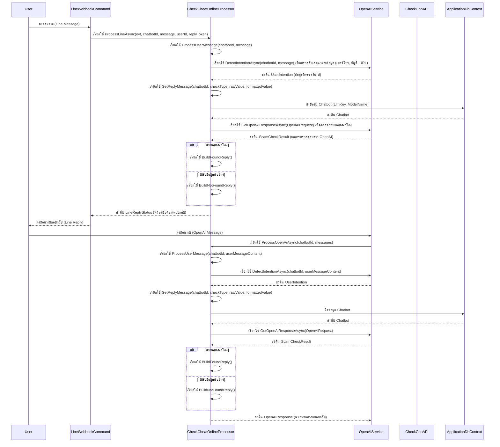
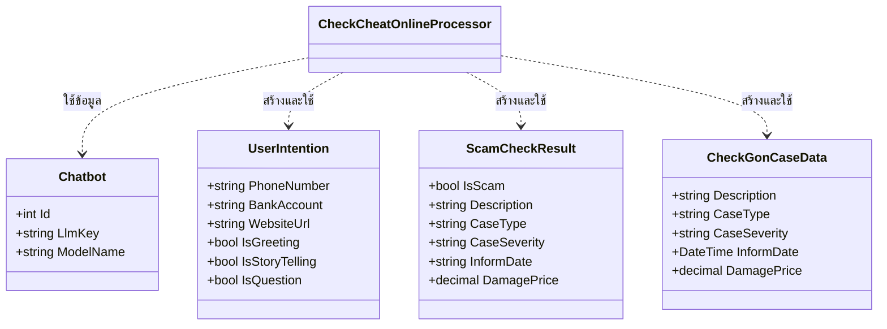

# CheckCheatOnlineProcessor

## วัตถุประสงค์ (Purpose)
`CheckCheatOnlineProcessor` มีหน้าที่หลักในการประมวลผลข้อความจากผู้ใช้เพื่อตรวจจับข้อมูลที่เกี่ยวข้องกับการฉ้อโกง เช่น หมายเลขโทรศัพท์ บัญชีธนาคาร หรือ URL เว็บไซต์ จากนั้นจะทำการตรวจสอบข้อมูลดังกล่าวกับบริการภายนอก (OpenAI และ CheckGon API) เพื่อยืนยันว่าเป็นข้อมูลที่เกี่ยวข้องกับการฉ้อโกงหรือไม่ และตอบกลับผู้ใช้ด้วยผลลัพธ์ที่เหมาะสม

## แผนภาพลำดับเหตุการณ์ (Sequence Diagram)

## แผนภาพเอนทิตี (Entity Diagram)
(เนื่องจาก `CheckCheatOnlineProcessor` ไม่ได้จัดการเอนทิตีโดยตรง แต่ใช้เอนทิตีที่มีอยู่และโมเดลข้อมูลชั่วคราว จึงไม่มีแผนภาพเอนทิตีเฉพาะสำหรับ Processor นี้ อย่างไรก็ตาม มีการใช้งานเอนทิตี `Chatbot` และโมเดลข้อมูลภายในดังนี้)

## บริการที่เกี่ยวข้อง (Related Services)
- `IApplicationDbContext`: ใช้สำหรับเข้าถึงข้อมูลในฐานข้อมูล เช่น ข้อมูล `Chatbot`
- `IHttpClientFactory`: ใช้สำหรับสร้าง `HttpClient` เพื่อเรียกใช้ CheckGon API
- `ILogger<CheckCheatOnlineProcessor>`: ใช้สำหรับบันทึกข้อมูล Log
- `IOpenAiService`: ใช้สำหรับสื่อสารกับบริการ OpenAI เพื่อตรวจจับเจตนาและตรวจสอบข้อมูลฉ้อโกง
