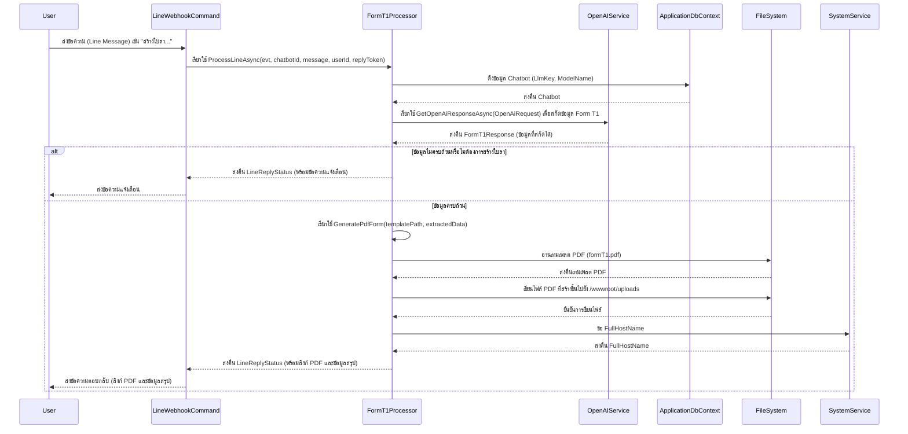
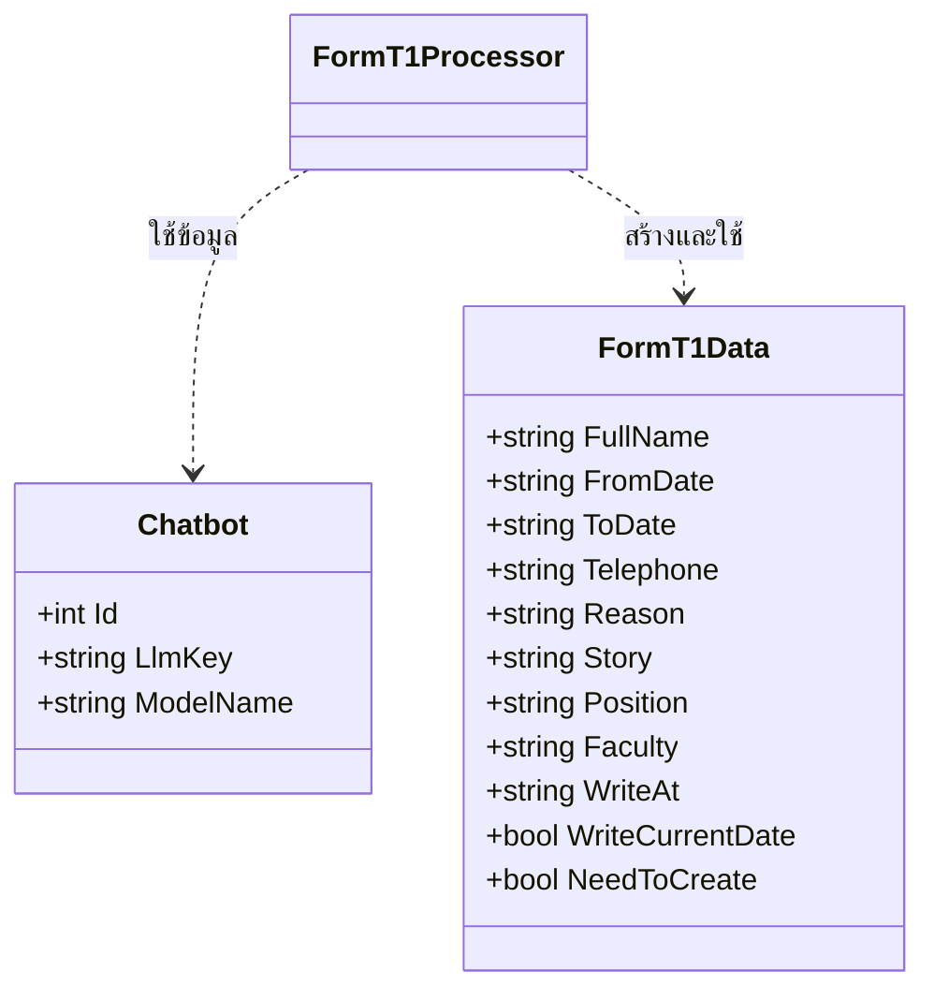

# FormT1Processor

## วัตถุประสงค์ (Purpose)
`FormT1Processor` มีหน้าที่ประมวลผลข้อความจากผู้ใช้เพื่อสร้างเอกสาร PDF ใบลา (Form T1) โดยใช้ข้อมูลที่สกัดได้จากข้อความของผู้ใช้ผ่านบริการ OpenAI Processor นี้จะรับผิดชอบในการเรียกใช้ OpenAI เพื่อวิเคราะห์ข้อความ, สกัดข้อมูลที่จำเป็นสำหรับการกรอกแบบฟอร์ม, สร้างไฟล์ PDF โดยใช้เทมเพลตที่กำหนดไว้, และส่งคืนลิงก์สำหรับดาวน์โหลดไฟล์ PDF ให้กับผู้ใช้

## แผนภาพลำดับเหตุการณ์ (Sequence Diagram)

## แผนภาพเอนทิตี (Entity Diagram)
(Processor นี้ไม่ได้จัดการเอนทิตีโดยตรง แต่ใช้เอนทิตี `Chatbot` และโมเดลข้อมูลชั่วคราวสำหรับการสกัดข้อมูล)

## บริการที่เกี่ยวข้อง (Related Services)
- `IApplicationDbContext`: ใช้สำหรับเข้าถึงข้อมูลในฐานข้อมูล เช่น ข้อมูล `Chatbot`
- `IHttpClientFactory`: ใช้สำหรับสร้าง `HttpClient` (ปัจจุบันไม่ได้ใช้โดยตรงใน ProcessLineAsync แต่มีอยู่ใน Constructor)
- `ILogger<FormT1Processor>`: ใช้สำหรับบันทึกข้อมูล Log
- `IWebHostEnvironment`: ใช้สำหรับเข้าถึงพาธของไฟล์เทมเพลต PDF และพาธสำหรับบันทึกไฟล์ที่สร้างขึ้น
- `ISystemService`: ใช้สำหรับดึง `FullHostName` เพื่อสร้าง URL สำหรับไฟล์ PDF ที่สร้างขึ้น
- `IOpenAiService`: ใช้สำหรับสื่อสารกับบริการ OpenAI เพื่อสกัดข้อมูลจากข้อความของผู้ใช้
