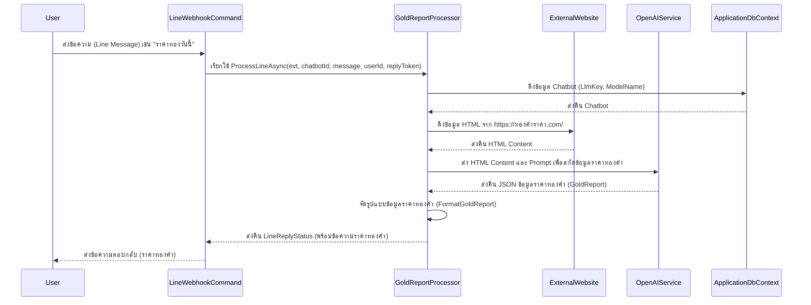
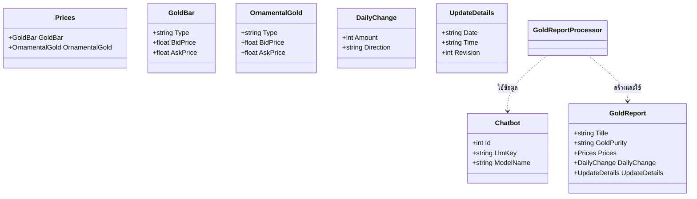

# GoldReportProcessor

## วัตถุประสงค์ (Purpose)
`GoldReportProcessor` มีหน้าที่ในการดึงข้อมูลราคาทองคำจากเว็บไซต์ภายนอก (`https://ทองคําราคา.com/`) จากนั้นใช้บริการ OpenAI เพื่อสกัดและจัดรูปแบบข้อมูลราคาทองคำที่ได้มาให้อยู่ในรูปแบบที่เข้าใจง่าย และส่งกลับเป็นข้อความตอบกลับไปยังผู้ใช้ผ่าน LINE หรือช่องทางอื่น ๆ

## แผนภาพลำดับเหตุการณ์ (Sequence Diagram)

## แผนภาพเอนทิตี (Entity Diagram)
(Processor นี้ไม่ได้จัดการเอนทิตีโดยตรง แต่ใช้เอนทิตี `Chatbot` และโมเดลข้อมูลชั่วคราวสำหรับการสกัดข้อมูล)

## บริการที่เกี่ยวข้อง (Related Services)
- `IHttpClientFactory`: ใช้สำหรับสร้าง `HttpClient` เพื่อดึงข้อมูลจากเว็บไซต์ราคาทองคำ
- `IOpenAiService`: ใช้สำหรับสื่อสารกับบริการ OpenAI เพื่อสกัดข้อมูลจาก HTML
- `IApplicationDbContext`: ใช้สำหรับเข้าถึงข้อมูลในฐานข้อมูล เช่น ข้อมูล `Chatbot`
