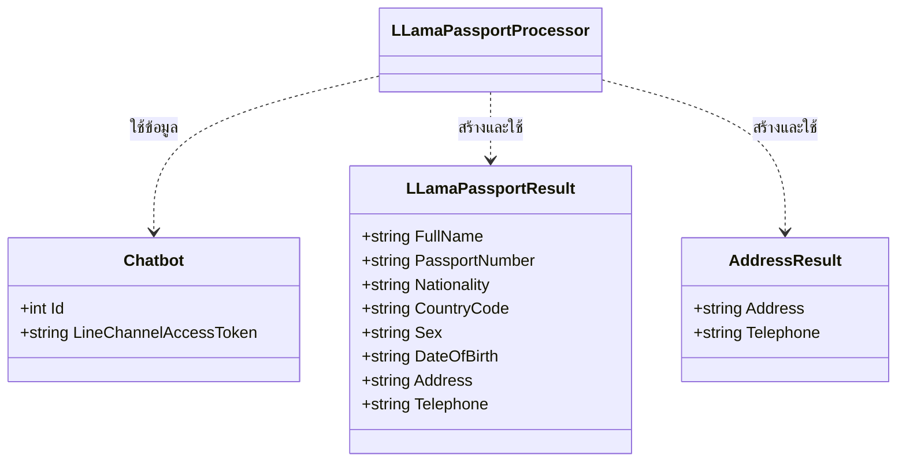

# LLamaPassportProcessor

## วัตถุประสงค์ (Purpose)
`LLamaPassportProcessor` มีหน้าที่ประมวลผลข้อความและรูปภาพจากผู้ใช้ที่เกี่ยวข้องกับข้อมูลหนังสือเดินทาง ที่อยู่ และเบอร์โทรศัพท์ โดยใช้บริการ AI ภายนอก (OpenRouter) ในการทำ OCR (Optical Character Recognition) เพื่อสกัดข้อมูลจากรูปภาพหรือข้อความที่ผู้ใช้ส่งมา นอกจากนี้ยังรองรับคำสั่งในการแสดงสถานะข้อมูลที่สกัดได้ และบันทึกข้อมูลลงใน Google Sheet

## แผนภาพลำดับเหตุการณ์ (Sequence Diagram)

```mermaid
sequenceDiagram
    participant User
    participant LineWebhookCommand
    participant LLamaPassportProcessor
    participant DistributedCache
    participant LineAPI
    participant OpenRouterAPI
    participant ApplicationDbContext
    participant LLamaPassportGoogleSheetHelper
    participant GoogleSheet

    User->>LineWebhookCommand: ส่งข้อความ/รูปภาพ (Line Message/Image)
    LineWebhookCommand->>LLamaPassportProcessor: เรียกใช้ ProcessLineAsync / ProcessLineImageAsync

    alt ข้อความเป็น "สถานะ"
        LLamaPassportProcessor->>DistributedCache: ดึงข้อมูลหนังสือเดินทางจาก Cache (passport_result:{userId})
        DistributedCache-->>LLamaPassportProcessor: ส่งคืน LLamaPassportResult
        LLamaPassportProcessor-->>LineWebhookCommand: ส่งคืน LineReplyStatus (พร้อมข้อมูลหนังสือเดินทาง)
        LineWebhookCommand-->>User: แสดงข้อมูลหนังสือเดินทาง
    alt ข้อความเป็น "บันทึก"
        LLamaPassportProcessor->>DistributedCache: ดึงข้อมูลหนังสือเดินทางจาก Cache
        DistributedCache-->>LLamaPassportProcessor: ส่งคืน LLamaPassportResult
        LLamaPassportProcessor->>ApplicationDbContext: ดึงข้อมูล Chatbot (LineChannelAccessToken)
        ApplicationDbContext-->>LLamaPassportProcessor: ส่งคืน Chatbot
        LLamaPassportProcessor->>LineAPI: ดึงชื่อโปรไฟล์ LINE (GetLineProfileName)
        LineAPI-->>LLamaPassportProcessor: ส่งคืน profileName
        LLamaPassportProcessor->>LLamaPassportGoogleSheetHelper: บันทึกข้อมูลลง Google Sheet (AppendRowAsync)
        LLamaPassportGoogleSheetHelper->>GoogleSheet: บันทึกข้อมูล
        GoogleSheet-->>LLamaPassportGoogleSheetHelper: ยืนยันการบันทึก
        LLamaPassportProcessor->>DistributedCache: ลบข้อมูลหนังสือเดินทางและสถานะจาก Cache
        LLamaPassportProcessor-->>LineWebhookCommand: ส่งคืน LineReplyStatus (พร้อมข้อความยืนยันการบันทึก)
        LineWebhookCommand-->>User: แสดงข้อความยืนยัน
    alt ส่งรูปภาพหนังสือเดินทาง
        LLamaPassportProcessor->>LineAPI: ดึงเนื้อหารูปภาพ (GetContentAsync)
        LineAPI-->>LLamaPassportProcessor: ส่งคืน ContentResult (base64 image data)
        LLamaPassportProcessor->>LLamaPassportProcessor: สร้าง Request Body สำหรับ OpenRouter (PassportPrompt)
        LLamaPassportProcessor->>OpenRouterAPI: เรียกใช้ CallOpenRouterApiAsync (เพื่อ OCR หนังสือเดินทาง)
        OpenRouterAPI-->>LLamaPassportProcessor: ส่งคืน LLamaPassportResult (ข้อมูลหนังสือเดินทาง)
        LLamaPassportProcessor->>DistributedCache: บันทึก LLamaPassportResult ลง Cache
        LLamaPassportProcessor->>DistributedCache: บันทึกสถานะ (PassportState.PassportNoAddressTelephone)
        LLamaPassportProcessor-->>LineWebhookCommand: ส่งคืน LineReplyStatus (พร้อมข้อมูลหนังสือเดินทางที่สกัดได้)
        LineWebhookCommand-->>User: แสดงข้อมูลหนังสือเดินทางและแจ้งให้ส่งข้อมูลที่อยู่/เบอร์โทร
    alt ส่งรูปภาพที่อยู่/เบอร์โทรศัพท์ หรือข้อความเบอร์โทรศัพท์
        LLamaPassportProcessor->>DistributedCache: ดึงข้อมูลหนังสือเดินทางจาก Cache
        DistributedCache-->>LLamaPassportProcessor: ส่งคืน LLamaPassportResult
        alt ข้อความเป็นเบอร์โทรศัพท์ 10 หลัก
            LLamaPassportProcessor->>LLamaPassportProcessor: อัปเดตเบอร์โทรศัพท์ใน LLamaPassportResult
        else ส่งรูปภาพที่อยู่/เบอร์โทรศัพท์
            LLamaPassportProcessor->>LineAPI: ดึงเนื้อหารูปภาพ (GetContentAsync)
            LineAPI-->>LLamaPassportProcessor: ส่งคืน ContentResult
            LLamaPassportProcessor->>LLamaPassportProcessor: สร้าง Request Body สำหรับ OpenRouter (AddressPrompt)
            LLamaPassportProcessor->>OpenRouterAPI: เรียกใช้ CallOpenRouterApiAsync (เพื่อ OCR ที่อยู่/เบอร์โทรศัพท์)
            OpenRouterAPI-->>LLamaPassportProcessor: ส่งคืน AddressResult (ข้อมูลที่อยู่/เบอร์โทรศัพท์)
            LLamaPassportProcessor->>LLamaPassportProcessor: อัปเดตที่อยู่และเบอร์โทรศัพท์ใน LLamaPassportResult
        end
        LLamaPassportProcessor->>DistributedCache: บันทึก LLamaPassportResult ที่อัปเดตแล้วลง Cache
        LLamaPassportProcessor-->>LineWebhookCommand: ส่งคืน LineReplyStatus (พร้อมข้อมูลหนังสือเดินทางที่สมบูรณ์)
        LineWebhookCommand-->>User: แสดงข้อมูลหนังสือเดินทางที่สมบูรณ์และแจ้งให้บันทึก
    end
```

## แผนภาพเอนทิตี (Entity Diagram)
(Processor นี้ใช้เอนทิตี `Chatbot` และโมเดลข้อมูลภายในเพื่อจัดเก็บข้อมูลที่สกัดได้ชั่วคราว)



## บริการที่เกี่ยวข้อง (Related Services)
- `IApplicationDbContext`: ใช้สำหรับเข้าถึงข้อมูลในฐานข้อมูล เช่น `Chatbot` เพื่อดึง `LineChannelAccessToken`
- `IHttpClientFactory`: ใช้สำหรับสร้าง `HttpClient` เพื่อเรียกใช้ LINE API และ OpenRouter API
- `ILogger<LLamaPassportProcessor>`: ใช้สำหรับบันทึกข้อมูล Log
- `LLamaPassportGoogleSheetHelper`: คลาสช่วยในการจัดการการบันทึกข้อมูลลง Google Sheet
- `IDistributedCache`: ใช้สำหรับจัดเก็บข้อมูลหนังสือเดินทางและสถานะของผู้ใช้ชั่วคราวใน Cache
