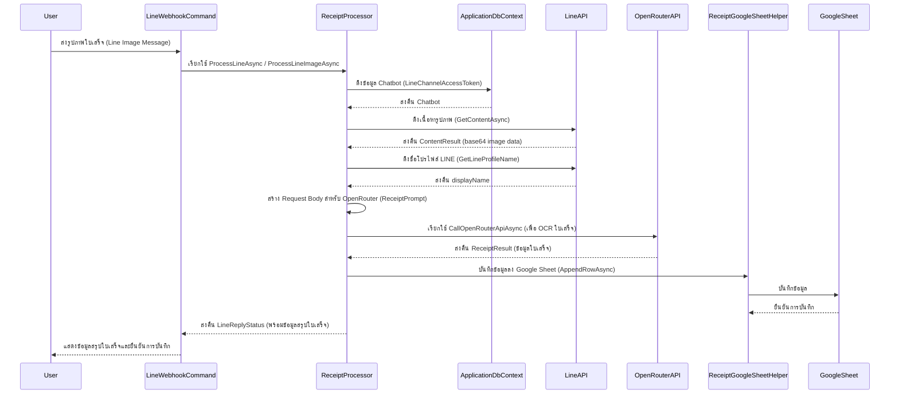
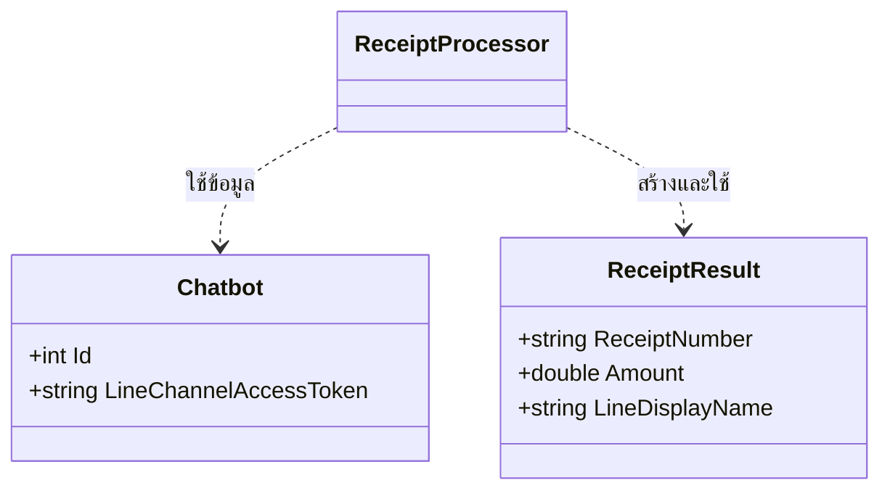

# ReceiptProcessor

## วัตถุประสงค์ (Purpose)
`ReceiptProcessor` มีหน้าที่ในการประมวลผลรูปภาพใบเสร็จที่ผู้ใช้ส่งมา โดยใช้บริการ AI ภายนอก (OpenRouter) ในการทำ OCR เพื่อสกัดข้อมูลสำคัญ เช่น เลขที่ใบเสร็จ และยอดเงิน จากนั้นจะบันทึกข้อมูลที่สกัดได้ลงใน Google Sheet และตอบกลับผู้ใช้ด้วยข้อมูลสรุปของใบเสร็จ

## แผนภาพลำดับเหตุการณ์ (Sequence Diagram)

## แผนภาพเอนทิตี (Entity Diagram)
(Processor นี้ใช้เอนทิตี `Chatbot` และโมเดลข้อมูลภายในเพื่อจัดเก็บข้อมูลที่สกัดได้ชั่วคราว)

## บริการที่เกี่ยวข้อง (Related Services)
- `IApplicationDbContext`: ใช้สำหรับเข้าถึงข้อมูลในฐานข้อมูล เช่น `Chatbot` เพื่อดึง `LineChannelAccessToken`
- `IHttpClientFactory`: ใช้สำหรับสร้าง `HttpClient` เพื่อเรียกใช้ LINE API และ OpenRouter API
- `ILogger<ReceiptProcessor>`: ใช้สำหรับบันทึกข้อมูล Log
- `ReceiptGoogleSheetHelper`: คลาสช่วยในการจัดการการบันทึกข้อมูลลง Google Sheet
- `IDistributedCache`: (ปัจจุบันไม่ได้ใช้โดยตรงใน ProcessLineAsync แต่มีอยู่ใน Constructor)
