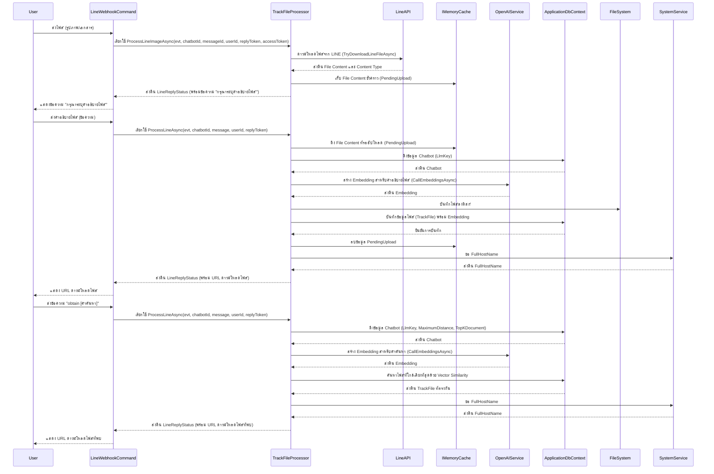
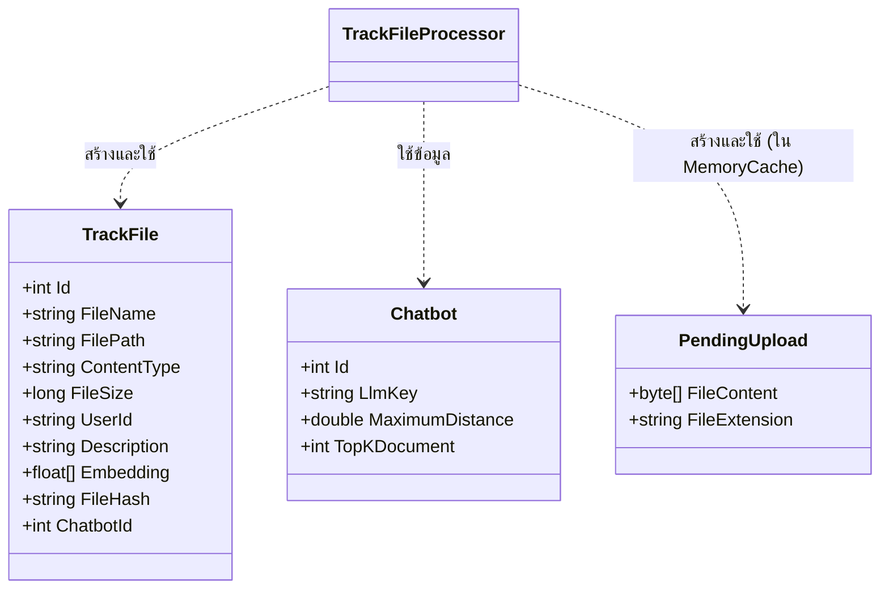

# TrackFileProcessor

## วัตถุประสงค์ (Purpose)
`TrackFileProcessor` มีหน้าที่จัดการการอัปโหลดและค้นหาไฟล์ตามคำอธิบายที่ผู้ใช้ให้มา โดยจะรับไฟล์จาก LINE, ใช้บริการ OpenAI เพื่อสร้าง Embedding จากคำอธิบายไฟล์, บันทึกไฟล์และข้อมูลเมตา (รวมถึง Embedding) ลงในฐานข้อมูล, และอนุญาตให้ผู้ใช้ค้นหาไฟล์ที่เกี่ยวข้องโดยใช้การค้นหาแบบ Vector Similarity

## แผนภาพลำดับเหตุการณ์ (Sequence Diagram)

## แผนภาพเอนทิตี (Entity Diagram)

## บริการที่เกี่ยวข้อง (Related Services)
- `IMemoryCache`: ใช้สำหรับจัดเก็บเนื้อหาไฟล์ที่กำลังอัปโหลดชั่วคราว
- `ISystemService`: ใช้สำหรับดึง `FullHostName` เพื่อสร้าง URL สำหรับดาวน์โหลดไฟล์
- `ILogger<TrackFileProcessor>`: ใช้สำหรับบันทึกข้อมูล Log
- `IWebHostEnvironment`: ใช้สำหรับเข้าถึงพาธของ Content Root เพื่อบันทึกไฟล์
- `IHttpClientFactory`: ใช้สำหรับสร้าง `HttpClient` เพื่อดาวน์โหลดไฟล์จาก LINE API
- `IApplicationDbContext`: ใช้สำหรับโต้ตอบกับฐานข้อมูล (ตาราง `TrackFiles` และ `Chatbots`)
- `IOpenAiService`: ใช้สำหรับสร้าง Vector Embeddings จากคำอธิบายและคำค้นหา
