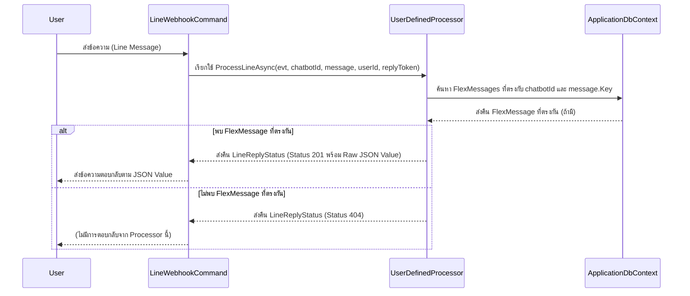
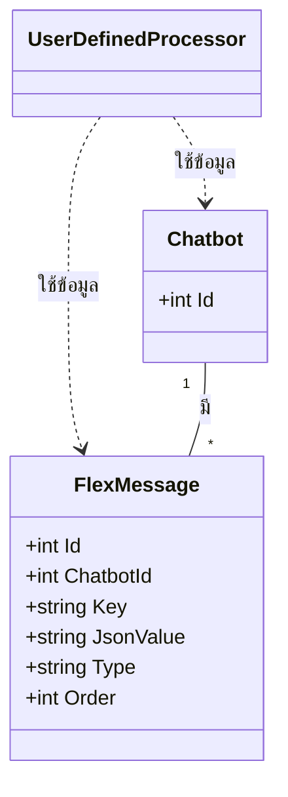

# UserDefinedProcessor

## วัตถุประสงค์ (Purpose)
`UserDefinedProcessor` มีหน้าที่ประมวลผลข้อความจากผู้ใช้เพื่อตรวจสอบว่าข้อความนั้นตรงกับคำสั่งที่ผู้ใช้กำหนดไว้ล่วงหน้า (User-Defined Commands) ซึ่งถูกเก็บอยู่ในตาราง `FlexMessages` หรือไม่ หากพบคำสั่งที่ตรงกัน จะส่งคืนค่า JSON ที่เกี่ยวข้องกับคำสั่งนั้นกลับไป หากไม่พบ จะส่งคืนสถานะว่าไม่พบข้อมูล

## แผนภาพลำดับเหตุการณ์ (Sequence Diagram)

## แผนภาพเอนทิตี (Entity Diagram)

## บริการที่เกี่ยวข้อง (Related Services)
- `IApplicationDbContext`: ใช้สำหรับเข้าถึงข้อมูลในฐานข้อมูล โดยเฉพาะตาราง `FlexMessages` เพื่อค้นหาคำสั่งที่ผู้ใช้กำหนด
